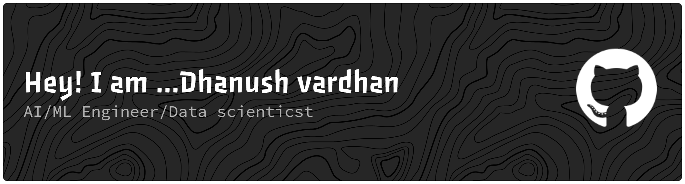

  

AI Engineer passionate about building production ML systems and LLM applications that solve real-world problems.

---

## 💫 About Me

🔭 AI & ML Engineer with experience building production systems  
🤖 Specialized in LLM Applications, Multi-Agent Systems & Deep Learning  
🌱 Love working with LangChain, LangGraph, and Graph Databases  
💡 Open to collaboration on AI/ML projects

---

## 💼 Experience

### 🚀 AI & ML Engineer Intern — Profolo
📍 Hyderabad | Nov 2025 – Present  

- Built production-grade AI hiring workflows using GPT-4, LangChain, and Pinecone  
- Contributed to TalentGPT — an LLM-powered recruiter search engine  
- Worked on prompt engineering, semantic search, and scalable AI systems  

---

### 🤖 AI & ML Engineer Intern — WINIT Software
📍 Hyderabad | Apr 2025 – Oct 2025  

- Developed AI-powered automated order processing workflows  
- Worked with LangGraph, Gemini, Mistral OCR, PostgreSQL, Celery, and Twilio  
- Helped build enterprise-scale intelligent automation systems  

---

## 🎯 What I Do

I architect and deploy **production-grade intelligent systems** that drive real business impact. My focus areas:

| Domain | Expertise |
|--------|-----------|
| **Agentic AI** | Autonomous agents, multi-step reasoning, task orchestration, tool integration |
| **LLMs & NLP** | Fine-tuning, RAG architectures, NL2SQL, conversational AI, prompt engineering |
| **Enterprise RAG** | Hybrid retrieval, re-ranking pipelines, knowledge management systems |
| **Production ML** | End-to-end pipelines, real-time inference, MLOps, scalable deployments |

---

## 🛠️ Tech Stack

**AI & LLM**

**ML & Data Science**

**Production & DevOps**

**Cloud & Services**

---

## 🔥 Featured Projects

### 🕸️ [Graph-Based AI for Supply Chain Intelligence](https://github.com/dhanushmekala04/Graph-Based-AI-for-Supply-Chain-Intelligence)
Knowledge graph with 2.1M+ relationships for supply chain risk analysis. 94.2% accuracy, analysis time reduced from days to 2.3 seconds.

**Tech:** Python, Neo4j, GraphRAG, FastAPI, OpenAI

---

### 📊 [Multi-Store Demand Forecasting System](https://github.com/dhanushmekala04/Multi-Store-Demand-Forecasting-System)
CNN-LSTM model forecasting 500+ SKUs with 16.49% MAPE. 35% improvement over baseline, simulated $150K annual savings.

**Tech:** TensorFlow, PyTorch, FastAPI, Docker

---

### 🧠 [Supply Chain Domain LLM - Phi-3 Fine-Tuned](https://github.com/dhanushmekala04/Supply-Chain-Domain-LLM---Phi-3-Fine-tuned-Model)
Fine-tuned Microsoft Phi-3 on 10K+ supply chain queries. 38% F1-score improvement, 87% first-query accuracy.

**Tech:** PyTorch, Hugging Face, QLoRA, Ollama

---

### 🤖 [Customer Support Ticket Management](https://github.com/dhanushmekala04/Customer-Support-Ticket-Management)
Multi-agent system with 6 specialized agents. 91% accuracy, reduced resolution time from 45 min to 2.3 seconds.

**Tech:** LangGraph, LangChain, Groq LLaMA, FastAPI

---

### 🛒 [Hybrid Retail Recommender](https://github.com/dhanushmekala04/Hybrid-Retail-Recommender)
Advanced recommendation system combining collaborative filtering and content-based approaches for personalized retail experiences.

**Tech:** Python, Scikit-learn, Pandas, FastAPI

---

---

### 💬 Let's Connect!

AI/ML Engineer | Data Scientist | Always open to discussing innovative projects and collaboration opportunities

📧 [dhanushmekala04@gmail.com](mailto:dhanushmekala04@gmail.com) | 💼 [LinkedIn](https://linkedin.com/in/dhanushmekala04) | 🐙 [GitHub](https://github.com/dhanushmekala04)

---

⭐️ From [dhanushmekala04](https://github.com/dhanushmekala04) | Open to collaboration and new opportunities

